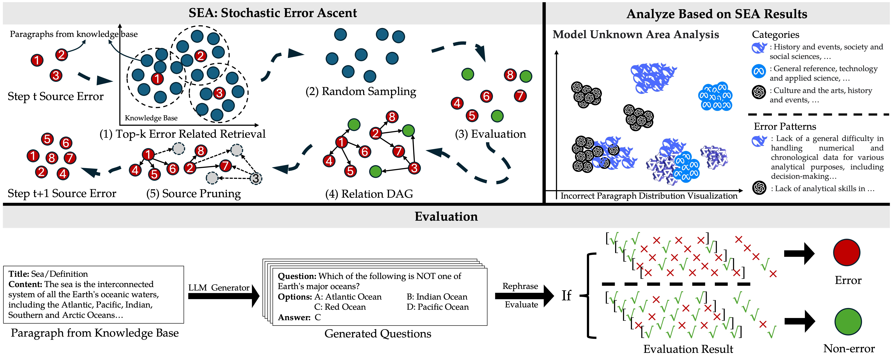

# Stochastic Error Ascent

Official implementation of stochastic error ascent (SEA) proposed by our paper: **Discovering Knowledge Deficiencies of Language Models on Massive Knowledge Base**

If you feel our work is helpful, feel free to ⭐ our project!

# How does SEA work?
SEA includes six steps:
1. Retrieve top-k error-related paragraphs from the knowledge base (see `utils/sample.py:page_related_sampling`)
2. Random sample from the retrieved batch
3. Evaluate the Testee LLM on the batch (see `utils/qa_generator.py`)
4. Construct a Relation DAG (see `utils/qa_generator.py`)
5. Prune the source error (see `utils/graph.py`)

# How to use?

## Preparation
1. Install Conda and create the conda environment (sea) by
    ```
    conda create -f environment.yml
    ```
    A Linux system is recommended.
3. Download the preprocessed Wikipedia data through [**this link**](https://drive.google.com/file/d/1Xj1EO9coL8cF0Tud3Z21_wT0DGkUmSMH/view?usp=drivesdk). You can check the data format in `examples/id_name_abs_url_example.json`

4. Specify the key file (create a `[See utils/devapi.py].key` file) for the closed-source model. You should check the `MODEL_MAP` in `utils/devapi.py` for details.

## Usage

All the following scripts will log the LLM's per-step answer in `res_same_topic[_abla]` and `res_same_seed`. You can check the output format in `examples/qa_example.json`

### Run SEA
You can run SEA with following commend:
```
conda activate sea
python sea.py
```
In `sea.py`, you need to specify the data path (`DATA_PATH`) to the preprocessed Wikipedia data. It includes all preprocessed pages (`id_name_abs_url_para`) and a faiss index file (`faiss_index_gte_para.ivf`). 

You can also adjust the total budget (`TOTAL_BUDGET`), per-step QA size (`QA_SIZE`), rephrase times (`REPHRASE`), top k value (`TOP_K_PAGE`), embedding model (`EMBEDDING_MODEL`), error and pruning threshold (`ERROR_THRES` and `PRUNING_THRES`), pruning method (`cumacc` and `avgacc`, where `avgacc` is an ablation of our method), QA generator model (default is `gpt-4o`), and seed (default is 42).

### Result for ablation studies (Figure 3) in our paper:
Run the following code:
```
conda activate sea
python sea_abla.py
python sea_random.py
```

### How can we analyze SEA's results (Figures 5 and 6)?
We leave a post-process code in `process_exist.py`, where you can specify the result you want to format. After that, you can run the code in `analysis.ipynb` for all the ablation and analysis result visualization.

# Contact
- Linxin Song (linxinso@usc.edu)

# Citation
### BibTeX:
```
TBD
```

### Github
You can check our paper PDF through [this link](paper/SEA_paper.pdf).
